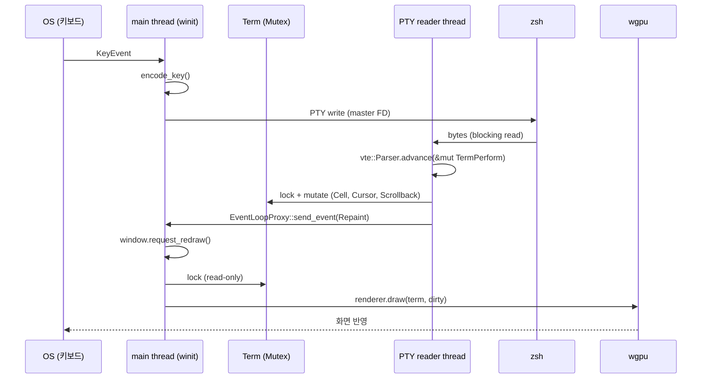

# pj001 — 자작 터미널 에뮬레이터 시스템 아키텍처 설계서

> 학습 목적의 GPU 렌더링 터미널 에뮬레이터. macOS 우선, Rust 작성.
> 본 문서는 **설계 문서**이며 구현 코드는 포함하지 않는다 (시그니처 스케치는 예외).
> 작성일: 2026-05-07 / 작성자: system-architect agent / 대상 독자: Derek

---

## 0. 문서 범위 / 사용법

본 설계서는 MVP까지의 모듈 경계, 데이터 흐름, 동시성, 핵심 타입을 확정한다.
이후 단계(IME, 마우스, reflow, kitty kbd protocol 등) 기능은 **확장 여지(seam)** 만 명시하고
지금 추상화하지 않는다 — YAGNI 원칙. 학습 목적이므로 *왜 그렇게 결정했는가*에 비중을 둔다.

각 결정은 다음 형태로 표기:
- `결정`: 무엇을 정했는가
- `이유`: 왜 그렇게 정했는가
- `대안`: 검토했지만 채택하지 않은 것
- `확인 필요`: 출처가 약하거나 Derek 합의가 필요한 부분

---

## 1. 크레이트 구성

### 결정: **단일 바이너리 크레이트** (`pj001/`, 현 상태 유지)

### 이유
- MVP의 모듈은 6~7개로 적고, 모두 강하게 결합된 하나의 애플리케이션을 구성한다 (PTY/VT/Grid/Render/Window/App).
- workspace로 분할하면 각 sub-crate에 `Cargo.toml` 유지 + 공개 API 경계 설계 비용이 발생한다.
- workspace의 진짜 효용은 (a) 다른 프로젝트에서 재사용, (b) 빌드 타임 분리, (c) 다른 팀/외부 contributor를 위한 명확한 경계인데, 학습 단독 프로젝트는 셋 다 약하다.
- Rust는 **모듈만으로도 충분한 캡슐화**를 제공한다 (`pub`, `pub(crate)`, `pub(super)`).

### 분할 전환 트리거 (이후 단계에서 검토)
- `core/` (PTY+VT+Grid)와 `gpu/` (렌더+윈도우)가 별도 진화 속도를 가지면 split.
- 통합 테스트가 Grid만 검증하는데 wgpu 드라이버 초기화를 강제 요구하기 시작하면 split.
- 적어도 MVP까지는 단일 크레이트로 간다.

### 대안 검토
| 옵션 | 장점 | 단점 |
|---|---|---|
| 단일 바이너리 (채택) | 최소 보일러플레이트, 빠른 시작 | 후일 외부 재사용 어려움 |
| workspace (`core` + `app`) | 헤드리스 테스트 / 재사용 | Cargo.toml 2~3개 관리, 학습 단계엔 과잉 |
| lib + bin (한 크레이트 내) | `cargo test`로 lib 단독 테스트 | `main.rs` ↔ `lib.rs` 책임 분리 명확화 필요 |

---

## 2. 모듈 경계 / 디렉토리 구조

### 결정: 도메인별 모듈 분리, `app`이 통합 지점

```
pj001/
├── Cargo.toml
├── docs/
│   └── architecture.md          ← 본 문서
└── src/
    ├── main.rs                  // 진입점. EventLoop 생성 → app::run()
    ├── lib.rs                   // (선택) 향후 lib 분리 대비 모듈 re-export 자리
    │
    ├── app/                     // 통합 계층 (controller)
    │   ├── mod.rs               // App 구조체, ApplicationHandler 구현
    │   ├── event.rs             // UserEvent enum (PTY → main thread 통지)
    │   └── input.rs             // KeyEvent → 바이트 시퀀스 변환 (encode_key)
    │
    ├── pty/                     // PTY 백엔드
    │   ├── mod.rs               // PtyHandle (소유: master writer, child)
    │   └── reader.rs            // 별도 스레드에서 PTY read 루프
    │
    ├── vt/                      // VT 파서 + 액션 핸들러
    │   ├── mod.rs               // re-export
    │   └── perform.rs           // TermPerform: vte::Perform 구현
    │                            //   → 실제 mutation은 grid에 위임
    │
    ├── grid/                    // 터미널 모델 (순수 데이터)
    │   ├── mod.rs               // Term, Cursor, Cell, Attrs, Color
    │   ├── grid.rs              // Grid (현재 화면 + alt screen 두 개)
    │   ├── scrollback.rs        // ScrollbackBuffer (ring buffer)
    │   └── damage.rs            // DirtyTracker (재렌더 영역)
    │
    ├── render/                  // GPU 렌더링
    │   ├── mod.rs               // Renderer (wgpu device/queue/pipeline)
    │   ├── atlas.rs             // GlyphAtlas (텍스처 + 캐시)
    │   ├── font.rs              // FontStack (fallback chain, 메트릭)
    │   ├── shader.wgsl          // 셀 인스턴싱 셰이더
    │   └── geometry.rs          // CellInstance(SoA→GPU) 빌더
    │
    ├── window/                  // winit 래퍼 (얇음)
    │   └── mod.rs               // WindowState (window + Surface + 메트릭)
    │
    └── error.rs                 // 크레이트 공용 에러 타입
```

### 모듈별 책임 + 공개 인터페이스

#### `app/`
- 책임: 모든 모듈의 lifecycle 통합. 메인 스레드의 winit 이벤트 루프 소유.
- 공개: `pub fn run() -> Result<()>`
- `App` 구조체가 `winit::application::ApplicationHandler<UserEvent>`를 구현.
  - 출처: https://docs.rs/winit/0.30.13/winit/application/trait.ApplicationHandler.html (검증됨)

#### `pty/`
- 책임: 자식 프로세스 spawn, master FD 소유, read 스레드 관리.
- 공개:
  - `PtyHandle::spawn(shell: &str, size: PtySize) -> Result<(PtyHandle, Receiver<Bytes>)>`
  - `PtyHandle::write(&mut self, data: &[u8]) -> io::Result<()>`
  - `PtyHandle::resize(&self, size: PtySize) -> Result<()>`
- 의존: `portable-pty 0.9.0`
  - `native_pty_system()` → `PtySystem::openpty(PtySize)` → `PtyPair { master, slave }`
  - `pair.slave.spawn_command(CommandBuilder)` → child
  - `pair.master.try_clone_reader()` / `take_writer()`
  - 출처: https://docs.rs/portable-pty/0.9.0/portable_pty/ (검증됨)

#### `vt/`
- 책임: PTY 바이트 스트림을 ANSI/VT 액션으로 파싱 → grid mutation.
- 공개:
  - `TermPerform<'a>`가 `vte::Perform`을 구현; `&'a mut Term`을 보유.
  - `Parser`는 `vte::Parser`를 그대로 사용 (래핑 안 함).
- vte 0.15.0 `Perform` 9개 메서드 (출처: https://docs.rs/vte/0.15.0/vte/trait.Perform.html — 검증됨):
  - `print`, `execute`, `hook`, `put`, `unhook`, `osc_dispatch`, `csi_dispatch`, `esc_dispatch`, `terminated`
- MVP에서 의미 있는 것은 `print` / `execute` / `csi_dispatch` / `esc_dispatch` 4개. 나머지는 빈 default.

#### `grid/`
- 책임: 터미널 모델의 *유일한 진실 공급원*. GPU/IO 의존성 0.
- 공개:
  - `Term` (Grid 두 개 + Cursor + Attrs + Scrollback 통합)
  - `Term::resize(cols, rows)`, `Term::switch_alt_screen(on: bool)`
  - 모든 mutation 메서드는 `&mut self`를 받는다.
- **벽**: `grid` 모듈은 `wgpu`/`winit`/`portable_pty`를 import 하지 않는다 (CI/lint로 강제 권장).

#### `render/`
- 책임: `&Term`을 읽어 GPU로 그린다. Term을 mutate 하지 않는다.
- 공개:
  - `Renderer::new(window: &Window) -> Result<Renderer>`
  - `Renderer::draw(&mut self, term: &Term, dirty: &DirtyTracker) -> Result<()>`
  - `Renderer::resize(&mut self, size: PhysicalSize<u32>)`

#### `window/`
- 책임: `winit::Window` + `wgpu::Surface` + 셀 메트릭(픽셀↔셀 환산).
- 공개: `WindowState { window, surface, surface_config, metrics }`

#### `error.rs`
- 책임: 크레이트 공용 `Error` enum + `Result<T> = std::result::Result<T, Error>`.

### 의존성 그래프 (단방향, 사이클 없음)

```
                 ┌──────┐
                 │ main │
                 └───┬──┘
                     ▼
                  ┌─────┐
   ┌──────────────┤ app ├──────────────┐
   │              └──┬──┘              │
   │                 │                 │
   ▼                 ▼                 ▼
┌─────┐           ┌─────┐           ┌────────┐
│ pty │           │ vt  │           │ window │
└──┬──┘           └──┬──┘           └────┬───┘
   │                 │                   │
   │                 ▼                   ▼
   │              ┌─────┐            ┌────────┐
   └─────────────►│grid │◄───────────┤ render │
                  └─────┘            └────────┘
                     ▲                   │
                     │  (read-only ref)  │
                     └───────────────────┘
                  ┌─────┐
                  │error│  ← 모든 모듈이 의존 (역방향 없음)
                  └─────┘
```

핵심 규칙:
- `grid`는 외부 의존성을 갖지 않는다 (테스트 용이, 재사용 여지).
- `render`는 `grid`를 **읽기만** 한다.
- `vt`는 `grid`를 **쓴다**.
- `app`만 모든 모듈을 알고 있다.

---

## 3. 데이터 흐름

### 3.1 입력 (키보드 → PTY)

```
[OS 키 이벤트]
    │
    ▼
winit::WindowEvent::KeyboardInput
    │
    ▼ (메인 스레드)
App::window_event
    │
    ▼
app::input::encode_key(&KeyEvent) -> Vec<u8>
    │   - "a" → b"a"
    │   - Enter → b"\r"
    │   - Ctrl-C → b"\x03"
    │   - Arrow Up → b"\x1b[A" (CSI A)
    │
    ▼
PtyHandle::write(bytes)
    │
    ▼
[OS PTY master FD]
    │
    ▼
[자식 프로세스 stdin (zsh)]
```

### 3.2 출력 (PTY → 화면)

```
[자식 프로세스 stdout]
    │
    ▼
[OS PTY master FD]
    │
    ▼ (PTY 리더 스레드, blocking read)
pty::reader 루프:
    let n = reader.read(&mut buf)?;
    {
      let mut term = term_mutex.lock();
      parser.advance(&mut TermPerform(&mut *term), &buf[..n]);
    }
    proxy.send_event(UserEvent::Repaint)?;
    │
    ▼ (메인 스레드, ApplicationHandler::user_event)
App::user_event(UserEvent::Repaint) → window.request_redraw()
    │
    ▼ (메인 스레드, WindowEvent::RedrawRequested)
let mut term = term_mutex.lock();
renderer.draw(&*term, term.dirty()); // 렌더는 read-only
term.dirty_mut().clear();
```

> 주의: `DirtyTracker`는 `Term` 안에 위치한다 (§5.3 참조).
> 별도 owner를 두지 않는 이유: dirty 마킹은 *반드시* mutate와 동시에 일어나야 하므로
> `Term` 안에 두는 편이 race 가능성을 원천 차단한다.

### 3.3 mermaid 다이어그램



### 3.4 dirty tracking 정책

- MVP: **행 단위 dirty 비트맵** (`Vec<bool>`, 길이 = rows). 어떤 행이라도 수정되면 그 행 전체 재업로드.
- 이유:
  - 셀 단위 dirty는 GPU 업로드를 작게 만들지만 부기 비용 증가. 80×24 화면에선 행 단위로 충분히 빠름.
  - alt screen 전환 / 스크롤은 전체 dirty 마킹.
- 확장 여지: 프로파일링 후 셀 단위로 좁힐 수 있게 `DirtyTracker` 인터페이스 유지.

---

## 4. 동시성 모델

### 4.1 스레드 구성

| 스레드 | 역할 | 차단 가능? |
|---|---|---|
| **메인 스레드** | winit 이벤트 루프, 키 입력, 렌더링, PTY write | ❌ 절대 안 됨 |
| **PTY 리더 스레드** | PTY master FD에서 blocking read, vte 파서 구동, Term 변경 | ✅ I/O 차단 OK |

### 결정: **두 스레드만 사용** (메인 + PTY 리더)

### 이유
- macOS의 NSApp/AppKit은 메인 스레드 전용. winit는 이를 강제한다.
  → 윈도우/렌더 = 반드시 메인 스레드.
- PTY 읽기는 blocking I/O이므로 메인 스레드에서 하면 안 됨.
- 별도 렌더 스레드를 만드는 것은 wgpu에선 가능하나, MVP에선 동기화 비용만 늘어남. **렌더는 메인에서 직접**.

### 4.2 공유 상태 / 락 전략

**유일한 공유 상태**: `Arc<Mutex<Term>>`

- 락 보유자 1: PTY 리더 스레드 — `print`/`csi_dispatch`로 mutation. 1회 read당 1회 lock.
- 락 보유자 2: 메인 스레드 — RedrawRequested 시 read-only 접근.

#### 왜 RwLock 아닌 Mutex?
- 한 시점에 writer 1 + reader 1만 있다. RwLock의 추가 복잡도 가치 없음.
- Mutex는 임계 구역이 짧으면 충분. 우리 경우 lock → vte advance(buf) → unlock 형태.

#### 왜 read 스레드가 직접 mutate (vte Parser를 그쪽에 두는가)
- 대안: PTY 스레드는 raw 바이트만 channel로 main에 보내고, main 스레드가 parse/mutate/render를 다 함.
- 채택 안 한 이유:
  - main 스레드 한 프레임 시간 안에 큰 출력이 누적되면 parse가 메인을 막는다 (`yes` 같은 출력 폭주 시 60Hz 유지 불가).
  - 데이터 1회 복사 추가 (channel queue 적재).
- 채택안의 위험: 락 contention. 그러나 PTY read는 read syscall 사이에 자연스럽게 짧은 비-락 구간이 있어 메인이 쉽게 lock을 잡을 수 있다.

### 4.3 채널: `std::sync::mpsc::Receiver`가 아닌 `winit::EventLoopProxy`

**결정**: PTY → main 통지는 `EventLoopProxy::send_event(UserEvent::Repaint)`. 별도 채널 없음.

### 이유
- winit 메인 스레드는 이벤트 루프에 묶여있다. mpsc receiver를 polling 하면 루프 모델 깨짐.
- `EventLoopProxy`는 정확히 이 용도(외부 스레드 → 이벤트 루프 깨우기)다.
  - 출처: https://docs.rs/winit/0.30.13/winit/event_loop/struct.EventLoopProxy.html (확인 필요 — 정확한 페이지는 직접 열어볼 것)
- `ApplicationHandler::user_event(&mut self, _, event: UserEvent)`로 받는다.

#### `UserEvent` enum (`src/app/event.rs`)
```rust
// 시그니처만 — 실제 구현 X
pub enum UserEvent {
    Repaint,            // PTY 리더가 Term을 변경했음
    ChildExited(i32),   // 자식 프로세스 종료
    PtyError(String),   // 리더 스레드에서 발생한 IO 에러 보고
}
```

### 4.4 `crossbeam-channel` vs `std::sync::mpsc`?

### 결정: **`std::sync::mpsc` 사용 (채널이 필요해질 때)**, `crossbeam`은 도입 안 함.

### 이유
- MVP는 1 producer → 1 consumer 구조 + EventLoopProxy 사용. 본격적인 채널이 거의 필요 없다.
- crossbeam의 진가는 `select!`, multi-producer/multi-consumer, bounded backpressure인데 우리는 그중 어느 것도 필요 없다.
- 추가 의존성을 정당화할 만한 이유 없음.
- 만약 입력 합성/IME 큐가 필요해지면 그때 도입.

### 4.5 PTY 리더 스레드 lifecycle

**spawn**: `PtyHandle::spawn(...)`이 (a) PtyHandle, (b) `JoinHandle<()>`을 함께 반환한다. 메인 스레드의 `App`이 둘 다 보유.

**작동 중**: 리더 스레드는 `master.try_clone_reader()`로 얻은 `Read`를 무한 루프로 read 한다. 매 iteration마다:
1. `read(&mut buf)?` (blocking).
2. `n == 0`이면 EOF → 자식이 종료된 것. 리더 스레드는 `proxy.send_event(UserEvent::ChildExited(code))` 후 자연 종료.
3. `Err(_)`이면 → `proxy.send_event(UserEvent::PtyError(msg))` 후 자연 종료.
4. 정상이면 `Term mutex lock → vte parser advance → unlock → proxy.send_event(Repaint)`.

**자식 wait**: `child.wait()`은 메인 스레드의 `App::user_event(UserEvent::ChildExited)` 핸들러에서 호출한다 (또는 PtyHandle drop 경로). `Child`는 `Send`이므로 어느 스레드에서 wait 해도 무방. 리더 스레드 안에서 wait를 호출하지 않는 이유: read EOF가 wait의 정확한 종료 코드를 보장하진 않으므로 main에서 명시적으로 한다.

**graceful shutdown**:
- 윈도우 닫힘 (CloseRequested) → `App::exiting`에서 `child.kill()` (또는 drop) → 리더 스레드의 read가 EOF/Error 반환 → 자연 종료 → main이 `JoinHandle::join()` 호출.
- 자식 자연 종료 → 리더 스레드 EOF 처리 후 종료 → `UserEvent::ChildExited` 수신 → main이 `event_loop.exit()` 호출 → `exiting()`에서 join.

**join 시점**: `ApplicationHandler::exiting(&mut self, _)`. 이 시점에 모든 winit 이벤트가 처리됐고 리더 스레드는 이미 종료/종료 중. `JoinHandle::join()`은 추가 대기 없이 즉시 또는 짧게 반환.

> 단순 원칙: **리더 스레드는 *판단을 하지 않는다*. 모든 종료 결정은 main 스레드의 `App`이 한다.** 리더는 결과(`Repaint` / `ChildExited` / `PtyError`)만 보고하고 exit한다.

### 4.6 winit 메인 스레드 강제 — 명시적 위험

⚠️ **macOS에서 winit은 메인 스레드에서만 EventLoop를 만들 수 있다.** 다른 스레드에서 `EventLoop::new()` 호출 시 panic 또는 silent break.
- 출처: https://docs.rs/winit/0.30.13/winit/event_loop/struct.EventLoop.html#method.new (확인 필요 — winit 공식 문서의 platform-specific 섹션 참고)
- 따라서: **`fn main`이 `EventLoop`를 직접 만들고**, PTY 리더는 EventLoop 생성 *후* 별도 스레드로 spawn 한다.

---

## 5. 핵심 타입 시그니처 스케치

> 시그니처와 필드 목록만. 구현 X. 실제 코드 작성 시 docs.rs로 재검증.

### 5.1 메모리 레이아웃 결정: **AoS (Array of Structs)**

```rust
// 결정안 (AoS)
struct Cell { ch: char, fg: Color, bg: Color, attrs: Attrs }
struct Grid { cells: Vec<Cell>, cols: u16, rows: u16 }
// 인덱싱: cells[y * cols as usize + x]
```

### 이유 (AoS 채택)
- **접근 패턴 일치**: `print(c)`는 한 셀의 모든 필드(ch+fg+bg+attrs)를 동시에 쓴다. AoS면 캐시라인 1번 접근.
- SoA는 GPU 업로드 시 attribute별 배열 분리에 유리하지만, 우리는 GPU에 보낼 때 별도 `CellInstance` 구조체로 변환한다 (5.5 참조). Term 내부 표현과 GPU 표현 분리.
- SoA는 SIMD 처리에 유리하지만 학습 단계에서 그 영역에 들어갈 일 없음.
- Cell 크기: char(4) + Color(4×2) + Attrs(2 정도) ≈ 16~20바이트. 80×24 → ~38KB. 캐시에 충분히 들어감.

### 5.2 grid 모듈 핵심 타입

```rust
// src/grid/mod.rs

#[derive(Clone, Copy, Debug, PartialEq)]
pub struct Cell {
    pub ch: char,           // 한 셀 1 char (대표 코드포인트)
    pub fg: Color,
    pub bg: Color,
    pub attrs: Attrs,
}

#[derive(Clone, Copy, Debug, PartialEq, Eq)]
pub enum Color {
    Default,                // 터미널 default fg/bg
    Indexed(u8),            // 16색 / 256색 팔레트
    Rgb(u8, u8, u8),        // 트루컬러
}

bitflags::bitflags! {       // bitflags 의존성 추가 검토
    #[derive(Clone, Copy, Debug, PartialEq, Eq)]
    pub struct Attrs: u16 {
        const BOLD       = 0b0000_0001;
        const ITALIC     = 0b0000_0010;
        const UNDERLINE  = 0b0000_0100;
        const REVERSE    = 0b0000_1000;
        const DIM        = 0b0001_0000;
        const HIDDEN     = 0b0010_0000;
        const STRIKE     = 0b0100_0000;
        const WIDE       = 0b1000_0000; // East Asian Width 2칸 셀의 *왼쪽*
        const WIDE_CONT  = 0b0001_0000_0000; // 오른쪽 placeholder
    }
}

#[derive(Clone, Copy, Debug)]
pub struct Cursor {
    pub x: u16,
    pub y: u16,
    pub fg: Color,
    pub bg: Color,
    pub attrs: Attrs,
    pub visible: bool,
}

pub struct Grid {
    cells: Vec<Cell>,
    cols: u16,
    rows: u16,
}

impl Grid {
    pub fn new(cols: u16, rows: u16) -> Self;
    pub fn cell(&self, x: u16, y: u16) -> Cell;
    pub fn cell_mut(&mut self, x: u16, y: u16) -> &mut Cell;
    pub fn clear(&mut self);
    pub fn scroll_up(&mut self, n: u16, scrollback: &mut ScrollbackBuffer);
    pub fn resize_truncate(&mut self, new_cols: u16, new_rows: u16);
    pub fn cols(&self) -> u16;
    pub fn rows(&self) -> u16;
    pub fn rows_iter(&self) -> impl Iterator<Item = &[Cell]>;
}
```

### 5.3 alt screen 처리

```rust
// 결정: 두 개의 Grid 인스턴스를 Term이 보유, 스왑.
//   이유: vim/htop은 alt screen 진입 시 main screen 내용을 *완전히 보존*해야 함.
//        한 Grid에 boolean flag 두는 식이면 main screen 내용이 소실됨.

pub struct Term {
    primary: Grid,
    alternate: Grid,
    using_alt: bool,
    cursor: Cursor,            // 활성 grid 기준
    saved_cursor_primary: Option<Cursor>,
    saved_cursor_alternate: Option<Cursor>,
    scrollback: ScrollbackBuffer,
    dirty: DirtyTracker,
}

impl Term {
    pub fn new(cols: u16, rows: u16) -> Self;
    pub fn active_grid(&self) -> &Grid;
    pub fn active_grid_mut(&mut self) -> &mut Grid;

    pub fn resize(&mut self, cols: u16, rows: u16);
    pub fn switch_alt_screen(&mut self, on: bool); // DECSET/RST 1049

    pub fn cursor(&self) -> &Cursor;
    pub fn cursor_mut(&mut self) -> &mut Cursor;

    pub fn scrollback(&self) -> &ScrollbackBuffer;
    pub fn dirty(&self) -> &DirtyTracker;
    pub fn dirty_mut(&mut self) -> &mut DirtyTracker;
}
```

### 5.4 ScrollbackBuffer / DirtyTracker

```rust
// src/grid/scrollback.rs

/// 고정 용량 ring buffer. capacity 초과 시 가장 오래된 행 drop.
pub struct ScrollbackBuffer {
    rows: VecDeque<Vec<Cell>>,
    capacity: usize,             // 행 단위 (예: 10_000)
    cols_at_push: u16,           // resize 시 정합 검증용
}

impl ScrollbackBuffer {
    pub fn new(capacity: usize) -> Self;
    pub fn push_row(&mut self, row: Vec<Cell>);
    pub fn iter_recent(&self, n: usize) -> impl Iterator<Item = &[Cell]>;
    pub fn len(&self) -> usize;
    pub fn capacity(&self) -> usize;
}

// src/grid/damage.rs

pub struct DirtyTracker {
    rows_dirty: Vec<bool>,       // length = grid.rows
    full: bool,                  // 전체 재렌더 필요 (alt screen 전환 등)
}

impl DirtyTracker {
    pub fn new(rows: u16) -> Self;
    pub fn mark_row(&mut self, y: u16);
    pub fn mark_all(&mut self);
    pub fn resize(&mut self, rows: u16);
    pub fn clear(&mut self);
    pub fn is_full(&self) -> bool;
    pub fn dirty_rows(&self) -> impl Iterator<Item = u16> + '_;
}
```

### 5.5 render 모듈 핵심 타입

> **주의**: 아래 시그니처는 설계 단계 스케치(2026-05-07). 실제 구현은 §6.4의 wgpu 29.0.3 / cosmic-text 0.19 API 변경점을 반영함 (M1~M5 진행 중 docs.rs 재확인으로 확정, 2026-05-08).

```rust
// src/render/mod.rs

pub struct Renderer {
    device: wgpu::Device,
    queue: wgpu::Queue,
    surface_format: wgpu::TextureFormat,
    pipeline: wgpu::RenderPipeline,
    atlas: GlyphAtlas,
    fonts: FontStack,
    instance_buffer: wgpu::Buffer,    // CellInstance 배열
    instance_capacity: usize,
}

impl Renderer {
    pub fn new(window: &Window) -> Result<Self>;
    pub fn resize(&mut self, size: PhysicalSize<u32>);
    pub fn draw(&mut self, term: &Term, dirty: &DirtyTracker) -> Result<()>;
    pub fn cell_metrics(&self) -> CellMetrics;
}

#[repr(C)]
#[derive(Clone, Copy, Pod, Zeroable)]   // bytemuck
pub struct CellInstance {
    pub grid_pos: [u32; 2],     // (x, y)
    pub atlas_uv: [f32; 4],     // u0, v0, u1, v1
    pub fg: [f32; 4],
    pub bg: [f32; 4],
    pub flags: u32,             // bold/italic/underline 등
}
```

### 5.6 GlyphAtlas / FontStack

```rust
// src/render/atlas.rs

pub struct GlyphAtlas {
    texture: wgpu::Texture,
    view: wgpu::TextureView,
    bin_packer: ShelfPacker,           // simple shelf-based packing
    cache: HashMap<GlyphKey, AtlasEntry>,
}

#[derive(Hash, PartialEq, Eq, Clone, Copy)]
pub struct GlyphKey {
    pub font_id: FontId,
    pub glyph_id: u32,
    pub size_px: u16,
    pub subpixel: u8,                  // 0..=3 (수평 서브픽셀 위치)
}

pub struct AtlasEntry {
    pub uv: [f32; 4],
    pub px_offset: [i16; 2],
    pub px_size: [u16; 2],
}

impl GlyphAtlas {
    pub fn new(device: &wgpu::Device, size: u32) -> Self;
    pub fn get_or_insert(&mut self, queue: &wgpu::Queue, key: GlyphKey, raster: &Raster)
        -> AtlasEntry;
}

// src/render/font.rs

pub struct FontStack {
    primary: cosmic_text::Font,         // (cosmic-text 채택 시; 6.1 참조)
    fallbacks: Vec<cosmic_text::Font>,
    metrics: CellMetrics,               // 셀 너비/높이/baseline (px)
}

pub struct CellMetrics {
    pub cell_w: u32,
    pub cell_h: u32,
    pub baseline: u32,
}
```

### 5.7 pty / vt 핵심 타입

```rust
// src/pty/mod.rs

pub struct PtyHandle {
    master: Box<dyn portable_pty::MasterPty + Send>,
    writer: Box<dyn std::io::Write + Send>,
    child: Box<dyn portable_pty::Child + Send + Sync>,
}

impl PtyHandle {
    pub fn spawn(shell: &str, size: portable_pty::PtySize)
        -> Result<(Self, std::thread::JoinHandle<()>)>;
    pub fn write(&mut self, bytes: &[u8]) -> std::io::Result<()>;
    pub fn resize(&self, size: portable_pty::PtySize) -> Result<()>;
}

// src/vt/perform.rs

pub struct TermPerform<'a> {
    pub term: &'a mut Term,
}

impl<'a> vte::Perform for TermPerform<'a> {
    fn print(&mut self, c: char) { /* ... */ }
    fn execute(&mut self, byte: u8) { /* CR, LF, BS, BEL, TAB ... */ }
    fn csi_dispatch(&mut self, params: &vte::Params, intermediates: &[u8],
                    ignore: bool, action: char) { /* CUP, ED, EL, SGR, DECSET 1049 ... */ }
    fn esc_dispatch(&mut self, intermediates: &[u8], ignore: bool, byte: u8) { /* ... */ }
    // 나머지(hook/put/unhook/osc_dispatch)는 default (빈 구현)
}
```

> vte 0.15 `Perform` 메서드 시그니처 출처: https://docs.rs/vte/0.15.0/vte/trait.Perform.html (검증됨, 9개 메서드)

---

## 6. 외부 의존성 (실제 검증된 최신 버전)

> 모든 버전은 2026-05-07 기준 `crates.io/api/v1/crates/<name>` 에서 직접 조회 (검증됨).

### 6.1 핵심 6 + α

| 크레이트 | 버전 | 역할 | 출처 |
|---|---|---|---|
| `winit` | **0.30.13** | 윈도우 + 이벤트 루프 (`ApplicationHandler` 패턴) | crates.io API |
| `wgpu` | **29.0.3** | GPU 추상화 (Metal 백엔드 on macOS) | crates.io API |
| `portable-pty` | **0.9.0** | PTY (`native_pty_system`, `MasterPty`, `CommandBuilder`) | crates.io API |
| `vte` | **0.15.0** | VT 파서 (Paul Williams 상태머신) | crates.io API |
| `unicode-width` | **0.2.2** | East Asian Width 1칸/2칸 판정 | crates.io API |
| `cosmic-text` | **0.19.0** | 폰트 fallback + shaping + 시스템 폰트 enumeration | crates.io API |
| `bytemuck` | **1.25.0** | `#[repr(C)]` 구조체를 byte slice로 (GPU 업로드) | crates.io API |
| `pollster` | **0.4.0** | wgpu의 async 초기화를 동기로 (block_on) | crates.io API |
| `thiserror` | **2.0.18** | 라이브러리 풍 에러 derive | crates.io API |
| `anyhow` | **1.0.102** | **필수** — `portable-pty 0.9`의 `PtySystem::openpty`가 `anyhow::Result`를 반환하므로 우리 에러 enum이 `anyhow::Error`를 보유해야 함. 출처: https://docs.rs/portable-pty/0.9.0/portable_pty/trait.PtySystem.html | crates.io API |
| `bitflags` | (확인 필요) | `Attrs` bitflags. 2.x 사용. | 미검증 |
| `log` + `env_logger` | (확인 필요) | 디버깅 로그. wgpu도 log 사용. | 미검증 |

### 호환성 검증
- `wgpu 29.0.3` → `raw-window-handle ^0.6.2` (필수)
- `winit 0.30.13` → `raw-window-handle ^0.6` (선택 dep, raw-window-handle 0.6 활성화)
- → 두 크레이트는 raw-window-handle 0.6에서 만나므로 호환 ✅

### 6.4 M1~M5 진입 시 발견된 API 변경점 (2026-05-08)

설계 시점(2026-05-07)에는 미반영. 구현 진입 직전 docs.rs 재확인으로 확정. §5.5/5.6의 타입 스케치는 변경 *전* 형태이므로 실제 구현 시 아래 차이를 반영해야 한다.

**wgpu 29.0.3** (이전 메이저 대비):

- `InstanceDescriptor::default()` 없음 → `InstanceDescriptor::new_without_display_handle()` 사용. 또한 `Instance::new`는 값으로 받음 (레퍼런스 X).
- `DeviceDescriptor`에 `experimental_features: wgpu::ExperimentalFeatures::disabled()` 필수 필드 추가.
- `RenderPassColorAttachment`에 `depth_slice: Option<u32>` 필드 추가.
- `RenderPassDescriptor`에 `multiview_mask: Option<u32>` 필드 추가.
- `Surface::get_current_texture()` 반환값이 `Result<SurfaceTexture, SurfaceError>`가 아니라 `CurrentSurfaceTexture` enum 7 variants(`Success` / `Suboptimal` / `Outdated` / `Lost` / `Timeout` / `Occluded` / `Validation`). 렌더 루프에서 match 필수. §7 에러 처리 표의 `SurfaceError::Lost/Outdated` 행은 `CurrentSurfaceTexture::Lost/Outdated`로 읽어야 함.
- `PipelineLayoutDescriptor.bind_group_layouts: &[Option<&BindGroupLayout>]` (이전 `&[&BindGroupLayout]`). `Some(&bgl)` 래핑 필수.
- `PipelineLayoutDescriptor.push_constant_ranges` → `immediate_size: u32`로 교체 (push constants는 immediate data로 통합).
- `RenderPipelineDescriptor.multiview` → `multiview_mask: Option<u32>` 이름 변경.

**cosmic-text 0.19**:

- `Buffer::set_text(text, &Attrs, Shaping, Option<Align>)` — `font_system` 인자는 받지 않음 (`shape_until_scroll`이 받음).
- `LayoutRun`이 `line_y: f32`(baseline의 Y offset), `line_top`, `line_height`를 직접 노출. baseline 휴리스틱(line_height × 0.78) 대신 `line_y.ceil()` 사용 가능 (M6-6에서 적용; font_size=14에서 두 값이 우연히 동일).
- `FontSystem::db()` → `&fontdb::Database`. `db.face(font_id)` → `Option<&FaceInfo>`. `face.post_script_name`, `face.families`로 fallback 진단 가능 (M6-7에서 활용).

### 추후 도입 검토
- `softbuffer` — wgpu 디버깅/대안용 CPU 백엔드. MVP에선 도입 안 함.
- `crossbeam-channel` — 채널 패턴이 복잡해지면 도입.
- `objc2` — IME(NSTextInputClient) 단계에서 필요.

### 의존성 추가 권장 작성 (`Cargo.toml`, 참고용)
```toml
[dependencies]
winit = "0.30"
wgpu = "29"
portable-pty = "0.9"
vte = "0.15"
unicode-width = "0.2"
cosmic-text = "0.19"
bytemuck = { version = "1", features = ["derive"] }
pollster = "0.4"
thiserror = "2"
log = "0.4"
env_logger = "0.11"
bitflags = "2"
```

---

## 7. 에러 처리 전략

### 결정
- **`error.rs`에 `thiserror`로 `pj001::Error` enum 정의**, 모든 모듈(grid/render/pty/vt/app)이 `Result<T, Error>` 반환.
- **`anyhow`는 필수 의존성**으로 두되, 직접 사용은 `Error::Pty(#[from] anyhow::Error)` 변환 한 곳에 한정한다. `main.rs`도 `Result<(), Error>`로 통일.

### 이유
- `thiserror`: 도메인별 에러 분류 가능. 호출자가 `match`로 처리 분기 가능.
- `anyhow`: 본래는 바이너리/main용이지만, **`portable-pty 0.9`가 `anyhow::Result`를 반환**하므로 (출처: https://docs.rs/portable-pty/0.9.0/portable_pty/trait.PtySystem.html) 어차피 의존성에서 제거할 수 없다. 그렇다면 굳이 `main.rs`에서 추가로 활용할 필요는 없고, `From<anyhow::Error> for Error`로 한 번만 변환한다.

### 에러 분류 (초안)
```rust
#[derive(thiserror::Error, Debug)]
pub enum Error {
    #[error("PTY error: {0}")]
    Pty(#[from] anyhow::Error),          // portable-pty가 anyhow를 반환

    #[error("IO error: {0}")]
    Io(#[from] std::io::Error),

    #[error("wgpu surface error: {0}")]
    Surface(#[from] wgpu::SurfaceError),

    #[error("wgpu request adapter failed")]
    NoAdapter,

    #[error("font load error: {0}")]
    Font(String),

    #[error("child process exited (code={0})")]
    ChildExited(i32),

    #[error("unsupported sequence")]
    UnsupportedSequence,
}
```

### 처리 패턴

| 시나리오 | 처리 |
|---|---|
| **PTY read EOF** (자식 종료) | reader 스레드가 `EventLoopProxy::send_event(UserEvent::ChildExited(code))` 송신, 메인이 graceful exit |
| **PTY read I/O error** (FD 오류 등) | `UserEvent::PtyError(msg)` 송신, 메인이 로그 + exit |
| **wgpu `SurfaceError::Lost/Outdated`** | `Renderer::resize` 재호출하여 surface 재구성 |
| **wgpu `SurfaceError::OutOfMemory`** | panic (현실적 복구 불가) |
| **vte 미지원 시퀀스** | log::warn 후 무시 (절대 panic X) |
| **Glyph rasterize 실패** | tofu(.notdef) 글리프 표시 후 log::warn |

### 패닉 정책
- `unwrap()` / `expect()`는 **초기화 단계에서만** 허용 (예: `EventLoop::new().expect("eventloop")`).
- 런타임 핫 패스(`print`, `csi_dispatch`, `draw`)에서는 절대 panic 금지.

---

## 8. 확장 여지 (Seam) — 지금 만들지 않고, 자리만 비워둔다

| 미래 기능 | 어디서 받아내는가 | 현재 상태 |
|---|---|---|
| **한글 IME 입력** | `app::input` 모듈에 IME 이벤트 진입점을 *지금은 만들지 않는다*. 자유 함수 `encode_key(KeyEvent)`로 시작 → IME 합성 시점에 `trait InputEncoder { fn encode(&mut self, ev: InputEvent) -> Vec<u8>; }`로 승격. NSTextInputClient 연결은 별도 `app::ime` 모듈을 그때 신설. | **미구현, 인터페이스도 미정** |
| **마우스 인코딩** | `app::input::encode_mouse(&MouseEvent, &Mode) -> Vec<u8>`. 모드 플래그를 `Term::mouse_mode: MouseMode`로 보유. SGR/X10/Normal 인코딩 분기. | **미구현. `Term`에 `mouse_mode` 자리 비움** |
| **kitty keyboard protocol** | `encode_key`가 `Term::kbd_protocol_flags`를 참조하여 분기. CSI `?u` 시퀀스 처리는 `vt`에서 `Term`의 플래그를 토글. | **자리 비움** |
| **Reflow (wrap 재계산)** | `Grid::resize_truncate` 옆에 `Grid::reflow(new_cols, new_rows)` 메서드 자리 비움. wrap line metadata는 `Cell`이 아닌 `Vec<RowMeta>`에 둘 것 (행 단위 wrap flag). | **메서드 시그니처 미생성** |
| **Sixel / 이미지** | `vte::Perform::hook/put/unhook`이 받음 (DCS 처리). `Term`에 `images: Vec<ImageRef>` 자리 비움. | **빈 default 구현** |
| **OSC 52 클립보드** | `vte::Perform::osc_dispatch`가 받음. `app::clipboard` 모듈 신설 예정. | **빈 default 구현** |
| **링크/Hyperlink (OSC 8)** | osc_dispatch에서 분기. Cell에 `link_id: Option<u32>` 추가 시점이 옴. | **자리 비움** |

### 핵심 원칙
- **이름만 적어두고 trait는 만들지 않는다.** 학습 단계에서 사용처 1개짜리 trait는 의미 없음.
- 첫 구현 자리가 자유 함수면 그대로 두고, 두 번째 구현이 필요해질 때 trait로 승격한다.

---

## 9. MVP 마일스톤 분해

각 단계 완료 시점에 **검증 가능한 동작**이 있어야 한다.

### M1 — "창이 뜬다"
**목표**: winit + wgpu 기본 골격. 검은 화면 한 장.
**모듈**: `app/`, `window/`, `render/` (최소).
**작업**:
- `EventLoop::new()` + `ApplicationHandler` 구현 (resumed/window_event).
- wgpu Adapter/Device/Queue 초기화 (pollster::block_on).
- Surface 구성, `RedrawRequested`에서 `clear` 색만 그림.
**검증**: 윈도우가 열리고, 닫기 버튼이 작동하고, 크기 조절이 가능하다.

---

### M2 — "셸이 돈다 (그리지는 않음)"
**목표**: PTY를 띄워 자식 zsh과 IO를 한다. 출력은 콘솔(stdout)에 흘려보냄.
**모듈**: `pty/`, `app/event.rs`.
**작업**:
- `PtyHandle::spawn` 구현.
- 별도 스레드에서 read 루프, 받은 바이트를 일단 `print!` (Debug) 한다.
- 키 입력 → `app::input::encode_key` → `pty.write`.
**검증**: 윈도우에 포커스 두고 `ls\n` 입력하면 stdout에 zsh 출력이 흘러나온다. `exit\n`이면 자식 종료가 stdout에 보고된다.

---

### M3 — "글자가 보인다 (단색, ASCII)"
**목표**: vte 파싱 + grid mutate + GPU에 단색 ASCII 글리프 출력.
**모듈**: `vt/`, `grid/`, `render/atlas.rs`, `render/font.rs`.
**작업**:
- `Term`/`Grid`/`Cursor`/`Cell` 정의 (모든 필드, 색상은 default).
- `vte::Perform`에서 `print` + `execute(LF/CR/BS)`만 처리.
- 폰트 1개 로드 → 글리프 atlas → 셀 instanced 렌더.
- `app::user_event(Repaint)` 와이어업.
**검증**: `ls`, `echo hello`, `pwd` 같은 명령의 출력이 화면에 보인다 (단색).

---

### M4 — "색이 입혀진다 (SGR 16/256/RGB)"
**목표**: SGR 처리, 16/256/트루컬러, 굵기/이탤릭/밑줄.
**모듈**: `vt/perform.rs::csi_dispatch`, `render/` 셰이더.
**작업**:
- `csi_dispatch` action `'m'` 처리: 0/1/3/4/7/22/23/24/27/30~37/38;5;n/38;2;r;g;b/40~47/...
- `Cell.fg`/`bg`/`attrs`에 반영.
- 셰이더에서 fg/bg/flags 사용.
**검증**: `ls --color`, `git status`, `grep --color`가 색깔 있게 나타난다. `htop`은 아직 깨질 수 있다(다음 단계).

---

### M5 — "vim/htop이 돈다 (alt screen + 커서 이동)"
**목표**: alt screen 전환, CSI 커서 이동(CUP/CUU/CUD/...), ED/EL, 한글 표시.
**모듈**: `grid/` (alt screen + scrollback), `vt/`, `unicode-width` 통합.
**작업**:
- `Term::switch_alt_screen` (DECSET/DECRST 1049).
- `csi_dispatch`: CUP, CUU/CUD/CUF/CUB, ED, EL, SU/SD, DECSTBM.
- `print(c)`에서 `unicode_width::UnicodeWidthChar::width(c)` 판정. 2칸이면 다음 셀에 `WIDE_CONT` 마킹.
- ScrollbackBuffer 와이어업 + 행 단위 dirty 트래커.
- WindowEvent::Resized → `master.resize(PtySize)` → SIGWINCH는 커널이 자동 전송.
**검증**:
- `vim` 진입/이탈 시 main screen 내용 보존.
- `htop`이 정상 갱신.
- `echo "안녕 hello"` 한글이 2칸으로 안 깨지고 보인다.
- 윈도우 크기 변경 시 셸 프롬프트가 새 폭에 맞춰 다음부터 그려진다 (기존 줄 reflow는 X).

---

### M6 (선택, MVP+) — "다듬기"
- 커서 깜빡임.
- 폰트 fallback: 한글 누락 시 시스템 한국어 폰트로.
- `--shell` 인자 / `$SHELL` 자동 감지.
- 로깅 (`env_logger`).

---

## 10. 알려진 미해결 결정 / 트레이드오프 (Derek 결정 필요)

> 기본값을 제안하되 최종 합의는 Derek.

> **확정 결정 (보존 결정)**: 텍스트 렌더 backend는 **cosmic-text 0.19**로 확정한다.
> 이유는 §6, 부록 A에 기재. 더 이상 미해결 항목 아님. 변경 트리거는 "한글 fallback이 cosmic-text 단독으로 동작하지 않을 때" 뿐.

> 아래는 **MVP 진입 시점에 Derek 합의가 필요한** 운영 정책 결정들이다. 모두 기본값을 제안했으며, 합의되지 않으면 기본값으로 진행해도 큰 결함 없음.

| # | 항목 | 제안 기본값 | 트레이드오프 |
|---|---|---|---|
| **A** | 글리프 atlas 가득 찰 때 정책 | grow-only (4096×4096 한 장으로 시작), 가득 차면 panic | MVP는 ASCII+한글 정도라 4K×4K는 사실상 안 참. LRU eviction은 M6 이후. |
| **B** | 스크롤백 사이즈 | 10,000 행 hard-coded | 설정 파일/CLI 인자/환경변수 도입은 MVP 후. |
| **C** | DPI 변경 / 모니터 이동 시 | scale factor 변경 시 셀 메트릭 재계산 + atlas 전체 폐기 후 재생성 | 첫 입력 시 hitch 1회. 우선 단순함 우선. |
| **D** | 커서 모양 / 깜빡임 | block, 깜빡임 OFF | CSI `q` 시퀀스 처리는 M6. |
| **E** | 한글 fallback 폰트 stack 명시? | cosmic-text의 시스템 DB에 위임, 명시 stack 없음 | 만약 cosmic-text가 한글 글리프를 못 찾으면 명시 stack 도입 (`Apple SD Gothic Neo` 등). M3 진입 시 실험으로 확정. |
| **F** | 스크롤백 view (휠/Shift-PgUp) | 미지원 | view offset 모드 필요 → M6 이후. |
| **G** | 윈도우 닫기 = 자식 종료 방식 | `Child` drop 시 자동 종료에 의존 (또는 명시 `kill()`) | portable-pty `Child` trait의 정확한 drop 동작은 docs.rs로 M2 진입 시 확인. |
| **H** | macOS 외 (Linux/Windows) 지원 | MVP 시도 안 함 | winit/wgpu는 크로스지만 PTY/폰트는 OS별 차이. 기록만 남기고 미루기. |
| **I** | bell (BEL, `\x07`) 처리 | 무음 | 시각 알림(타이틀 깜빡임)은 M6 이후. |

### 그 외 출처가 약해 추후 직접 검증 필요
- `winit::EventLoopProxy::send_event` 의 정확한 시그니처와 `EventLoop` 생성 시 `with_user_event()` 빌더 사용법.
- `portable-pty`의 `MasterPty::resize` 시그니처와 child drop 시 동작.
- `cosmic-text 0.19`의 시스템 폰트 enumeration API 이름 (`FontSystem::new()`, `Buffer`, `SwashCache` 등).

위 셋은 M1~M5 진입 시 docs.rs로 시그니처 확정 후 코드 작성.

---

## 부록 A. 의사결정 흐름 요약

| 결정 | 선택 | 핵심 근거 |
|---|---|---|
| 크레이트 구성 | 단일 바이너리 | 모듈 7개, 학습 단독 — workspace 과잉 |
| 동시성 | 메인 + PTY 리더 (2 스레드) | macOS 메인 스레드 강제 + PTY blocking IO |
| 락 | `Arc<Mutex<Term>>` | writer 1 / reader 1, 임계 구역 짧음 |
| 통지 | `EventLoopProxy::send_event` | mpsc polling은 winit 모델과 충돌 |
| 채널 라이브러리 | std::sync::mpsc (필요시) | crossbeam의 select 등이 필요 없음 |
| 메모리 레이아웃 | AoS (`Vec<Cell>`) | 접근 패턴이 행/셀 단위, SoA의 SIMD 이득 없음 |
| Alt screen | 두 Grid 인스턴스 | vim/htop이 main 보존 필요 |
| Dirty | 행 단위 비트맵 | 셀 단위는 부기 비용 비례 안 함 |
| 에러 | `thiserror` 도메인 enum + `anyhow` (`From`만 사용) | portable-pty가 anyhow를 반환하므로 anyhow 의존성은 강제 |
| Reflow | MVP 미지원 (truncate) | Alacritty도 늦게 도입한 영역 — 학습 무리 |
| 텍스트 렌더 | cosmic-text 0.19 | 한글 fallback "그냥 동작" — 학습 시간 절약 |

---

## 부록 B. 환각 방지 점검표 (본 문서 작성 시 적용한 것)

| 항목 | 검증 방법 | 결과 |
|---|---|---|
| 6개 핵심 crate 버전 | `crates.io/api/v1/crates/<n>` 직접 호출 | ✅ 검증 |
| `vte::Perform` 메서드 9개 | docs.rs 0.15.0 페이지 직접 fetch | ✅ 9개 |
| `winit::ApplicationHandler` 메서드 | docs.rs 0.30.13 페이지 직접 fetch | ✅ 7개 |
| `portable-pty` API 흐름 | docs.rs 0.9.0 페이지 직접 fetch | ✅ openpty/spawn_command/take_writer |
| wgpu 29 ↔ winit 0.30 호환성 | wgpu 29.0.3 의존성 dump → raw-window-handle ^0.6.2 / winit 0.30.13 raw-window-handle ^0.6 (옵션) | ✅ 만남 |
| `cosmic-text` 시스템 폰트 API 이름 | 미검증 | ⚠️ 확인 필요 (M3 진입 시) |
| `bitflags` 2.x 사용법 | 미검증 | ⚠️ 확인 필요 |
| `winit::EventLoopProxy::send_event` 정확한 빌더 | 미검증 | ⚠️ 확인 필요 |

⚠️ 표시는 코드 작성 단계 진입 직전에 다시 docs.rs로 확정한다.

---

*문서 끝.*
